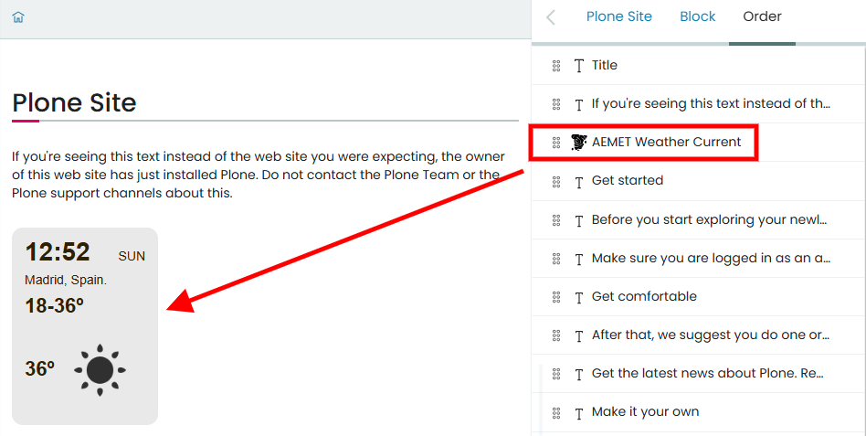
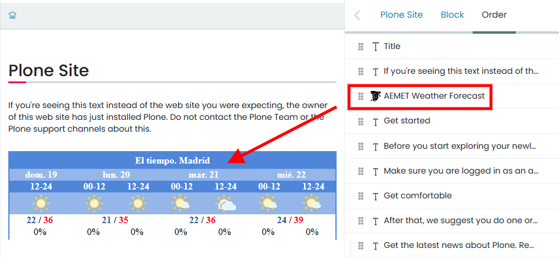
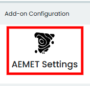
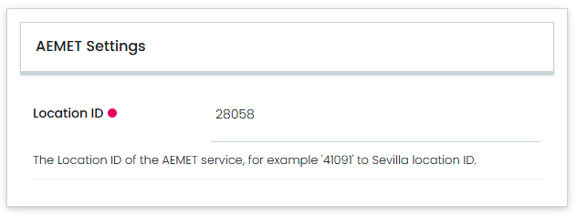
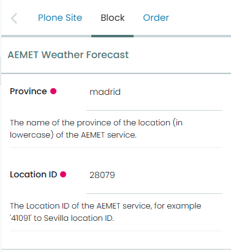

---
myst:
  html_meta:
    "description": "AEMET integration with Volto how-to guides"
    "property=og:description": "AEMET Volto how-to guides"
    "property=og:title": "AEMET integration with Volto how-to guides"
    "keywords": "Volto, AEMET integration with Volto, how-to, guides"
---

# General information

This part of the documentation contains how-to guides, including installation and usage.

## Features

- Add a new `AEMET Weather Current` Volto content block.

- Add a new `AEMET Weather Forecast` Volto content block.

- Add a new `AEMET Settings` Volto control panel.

- Add a new react component called `Weather`, that uses data from the AEMET service.

## Screenshots

**AEMET Weather Current Volto content block**



---

**AEMET Weather Forecast Volto content block**



---

## Backend integration

To use this product in Plone CMS, you needs to include the following add-on in your project: https://github.com/collective/collective.volto.aemet

## Translations

This product has been translated into

- English

- Spanish

## Install it

To install your project, you must choose the method appropriate to your version of Volto.


### Volto 18 and later

Add `volto-aemet` to your `package.json`:

```json
"addons": [
    "volto-aemet": "*"
]
```

```json
"dependencies": {
    "volto-aemet": "*"
}
```

#### Install from Github

If you trying to install from Github you need edit the `mrs.developer.json` file:

```json
{
  "volto-aemet": {
    "develop": true,
    "output": "./packages/",
    "package": "volto-aemet",
    "url": "git@github.com:collective/volto-aemet.git",
    "https": "https://github.com/collective/volto-aemet.git",
    "branch": "main"
  }
}
```

The `mrs.developer.json` is using by an NodeJS utility called `mrs.developer` that makes
it easy to work with NPM projects containing lots of packages, of which you only want to
develop some.

Also add `volto-aemet` to your `package.json`:

```json
"addons": [
    "volto-aemet": "*"
]
```

```json
"dependencies": {
    "volto-aemet": "workspace:*",
}
```

---
### Volto 17 and earlier

Create a new Volto project (you can skip this step if you already have one):

```
npm install -g yo @plone/generator-volto
yo @plone/volto my-volto-project --addon volto-aemet
cd my-volto-project
```

Add `volto-aemet` to your package.json:

```JSON
"addons": [
    "volto-aemet"
],

"dependencies": {
    "volto-aemet": "*"
}
```

Download and install the new add-on by running:

```
yarn install
```

Start volto with:

```
yarn start
```

## Enable it

Visit http://localhost:3000/ in a browser, login, and check the awesome new features.

## Setting it

This integration uses the `AEMET` service called '[Predicción por municipios](https://www.aemet.es/es/eltiempo/prediccion/municipios)'
on its website. For example, for the every municipality:

- '[Sevilla (Sevilla)](https://www.aemet.es/es/eltiempo/prediccion/municipios/sevilla-id41091)', it provides very detailed information
   on the weather forecast for this municipality. It also exports information in `XML` format:

   - https://www.aemet.es/xml/municipios/localidad_41091.xml

     **NOTE:** The `XML` file name has a prefix called `localidad_` and a suffix with an **ID**. For example, the ID for the municipality
     of _Seville_ is `41091`. This **ID** will be used later in the `AEMET Settings` control panel.

To use this add-on, go to the `Site setup`, next to the ``Add-on Configuration`` icon, as shown below:



---

This `AEMET Settings`, you can access the control panel, as shown below:



In this control panel, you can configure the following fields:

- ``Location ID``, The Location ID of the `AEMET` service, for example '41091' to Sevilla location ID.

## Use it

To use the `AEMET` integration you need add the [volto-aemet](https://github.com/collective/volto-aemet) add-on, in your Volto project and
use the amazain features incluided.

### Volto content block

This add-on include two (02) Volto content block incluided as the following:

#### AEMET Weather Current

This Volto content block has no customisation options, just uses the settings defined in the `AEMET Settings` control panel.


---

#### AEMET Weather Forecast

This Volto content block uses 

This Volto content bloc allows you to add the original widget provided by `AEMET` to the user’s interface, as shown below:


When you select the block, the available block settings are displayed in the `Block` tab in the right-hand column, as shown below:



##### Opciones básicas

**Province**

    The name of the province of the location (in lowercase) of the AEMET service.

**Location ID**

    The Location ID of the AEMET service, for example '41091' to Sevilla location ID.

This widget integration uses the `AEMET` service called '["Widget" para la predicción por municipios](https://www.aemet.es/es/eltiempo/widgets/municipios/)'
on its website. For example, for the every municipality:

- '[Madrid (Madrid)](https://www.aemet.es/es/eltiempo/widgets/municipios/madrid-id28079)', it provides very detailed information widget
   on the weather forecast for this municipality.

   - https://www.aemet.es/es/eltiempo/widgets/municipios/madrid-id28079

     **NOTE:** In the previous url, it has a prefix `madrid` and a suffix numeric as an  **id**. For example, the ID (suffix numeric) for the municipality
     of _Madrid_ is `28079`.

- '[Sevilla (Sevilla)](https://www.aemet.es/es/eltiempo/widgets/municipios/sevilla-id41091)', it provides very detailed information
   on the weather forecast for this municipality.

   - https://www.aemet.es/es/eltiempo/widgets/municipios/sevilla-id41091

     **NOTE:** In the previous url, it has a prefix `sevilla` and a suffix numeric as an  **id**. For example, the ID (suffix numeric) for the municipality
     of _Sevilla_ is `41091`.
