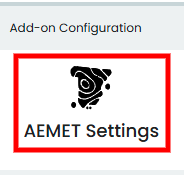
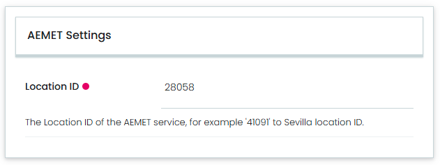
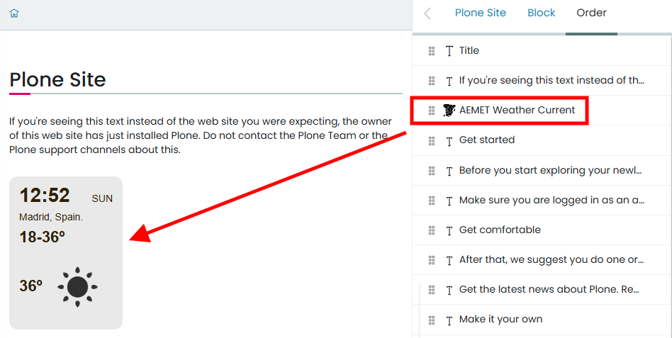
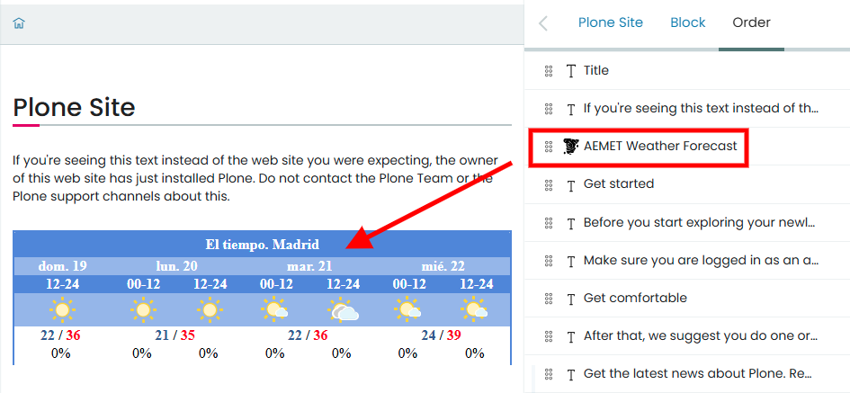
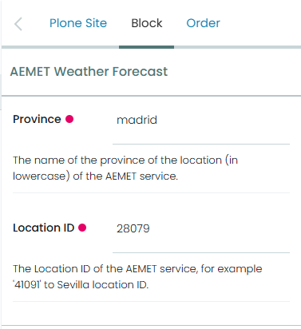

---
myst:
  html_meta:
    "description": "AEMET integration with Volto how-to guides"
    "property=og:description": "AEMET Volto how-to guides"
    "property=og:title": "AEMET integration with Volto how-to guides"
    "keywords": "AEMET, service, Volto, integration, documentation, how-to, guides"
---

# General information

This part of the documentation contains how-to guides, and including installation and usage.

## Features

- {term}`Control panel` in {term}`Plone` registry to manage {term}`AEMET Settings`.

- Add a restricted RESTful API endpoint that exposes the {term}`AEMET Settings` for {term}`Volto` _integration_.

-  {term}`Volto` content blocks:

   - Add a {ref}`aemet-weather-current-block` block.

   - Add a {ref}`aemet-weather-forecast-block` block.

- Add a `useWeatherData` hooks, that uses data from the {term}`AEMET` service.

- Add a `WeatherCurrent` component, that uses to render the {ref}`aemet-weather-current-block` content block.

## Plone CMS integration

To use this product in {term}`Plone` CMS, you needs to include the following {term}`add-on`
in your project: {term}`collective.volto.aemet`.

## Translations

This product support the following languages:

- Basque

- Catalan

- English

- Galician

- Spanish

## Compatibility

- Tested with `Node.js` 22.16.0 and {term}`Volto` 18.

## Install it

To install in your project, the {term}`volto-aemet` {term}`add-on`, you must choose the method appropriate
to your version of {term}`Volto`.


### Volto 18 and later

```{warning}
Just for the {term}`Volto` 18 and later versions project installation.
```

Add {term}`volto-aemet` to your `package.json` file:

```json
"addons": [
    "volto-aemet": "*"
]
```

```json
"dependencies": {
    "volto-aemet": "*"
}
```

#### Install from Github

If you trying to install from Github you need edit the `mrs.developer.json` file:

```json
{
  "volto-aemet": {
    "develop": true,
    "output": "./packages/",
    "package": "volto-aemet",
    "url": "git@github.com:collective/volto-aemet.git",
    "https": "https://github.com/collective/volto-aemet.git",
    "branch": "main"
  }
}
```

The `mrs.developer.json` file is using by an `Node.js` utility called `mrs.developer` that makes
it easy to work with `npm` projects containing lots of packages, of which you only want to
develop some.

Also add {term}`volto-aemet` to your `package.json` file:

```json
"addons": [
    "volto-aemet": "*"
]
```

```json
"dependencies": {
    "volto-aemet": "workspace:*",
}
```

---

### Volto 17 and earlier

```{warning}
Just for the {term}`Volto` 17 and earlier versions project installation.
```

Create a new {term}`Volto` project (you can skip this step if you already have one):

```
npm install -g yo @plone/generator-volto
yo @plone/volto my-volto-project --addon volto-aemet
cd my-volto-project
```

Add {term}`volto-aemet` to your `package.json` file:

```json
"addons": [
    "volto-aemet"
],

"dependencies": {
    "volto-aemet": "*"
}
```

Download and install the new {term}`add-on` by running:

```shell
yarn install
```

Start {term}`Volto` with:

```shell
yarn start
```

## Enable it

Visit http://localhost:3000/ in a browser, login, so go to `Site setup`, next to `Add-ons` {term}`Control panel`, 
find the {term}`collective.volto.aemet` {term}`add-on` and select the `Install` button for enabled it.

## Settings it

This integration uses the {term}`AEMET` service called '[Predicción por municipios](https://www.aemet.es/es/eltiempo/prediccion/municipios)'
on its website. For example, for the every municipality:

- '[Sevilla (Sevilla)](https://www.aemet.es/es/eltiempo/prediccion/municipios/sevilla-id41091)', it provides detailed information
   on the weather forecast for this municipality. It also exports information in `XML` format:

   - https://www.aemet.es/xml/municipios/localidad_41091.xml

     ```{note}
     The `XML` file name has a prefix called `localidad_` and a suffix with an **ID**. For example,
     the ID for the municipality of _Seville_ is `41091`. This **ID** will be used later in the
     {term}`AEMET Settings` {term}`Control panel`.
     ```

To use this {term}`add-on`, go to the ``Site setup``, next to the ``Add-on Configuration`` icon, as shown below:



This {term}`AEMET Settings`, you can access the {term}`Control panel`, as shown below:



In this {term}`Control panel`, you can configure the following fields:

- {term}`Location ID`, The Location ID of the {term}`AEMET` service, for example '41091' to Sevilla location ID.

## Use it

To use the {term}`AEMET` integration you need add the {term}`volto-aemet` {term}`add-on`, in
your {term}`Volto` project and use the amazing features into this {term}`add-on`.

### Volto content block

This add-on include two (02) {term}`Volto` content blocks as the following:

(aemet-weather-current-block)=
#### AEMET weather current

This {term}`Volto` content block has no customisation options, just uses the settings defined in the {term}`AEMET Settings` {term}`Control panel`.



---

(aemet-weather-forecast-block)=
#### AEMET weather forecast

This {term}`Volto` content block lets you to add the original widget provided by {term}`AEMET` to the user’s interface, as shown below:



When you select the block, the available block settings are displaying in the `Block` tab in the right-hand column, as shown below:



##### Basic options

- **Province**

  The name of the province of the location (in lowercase) of the AEMET service.

- {term}`Location ID`

  The {term}`Location ID` of the {term}`AEMET` service, for example '41091' to Sevilla location ID.

This widget integration uses the {term}`AEMET` service called '["Widget" para la Predicción por municipios](https://www.aemet.es/es/eltiempo/widgets/municipios/)'
on its website. For example, for the every municipality:

- '[Madrid (Madrid)](https://www.aemet.es/es/eltiempo/widgets/municipios/madrid-id28079)', it provides detailed information widget
   on the weather forecast for this municipality.

   - https://www.aemet.es/es/eltiempo/widgets/municipios/madrid-id28079

     ```{note}
     In the previous url, it has a prefix `madrid` and a suffix numeric as an  **id**. For example,
     the ID (suffix numeric) for the municipality of _Madrid_ is `28079`.
     ```

- '[Sevilla (Sevilla)](https://www.aemet.es/es/eltiempo/widgets/municipios/sevilla-id41091)', it provides detailed information
   on the weather forecast for this municipality.

   - https://www.aemet.es/es/eltiempo/widgets/municipios/sevilla-id41091

     ```{note}
     In the previous url, it has a prefix `sevilla` and a suffix numeric as an  **id**. For example,
     the ID (suffix numeric) for the municipality of _Sevilla_ is `41091`.
     ```
